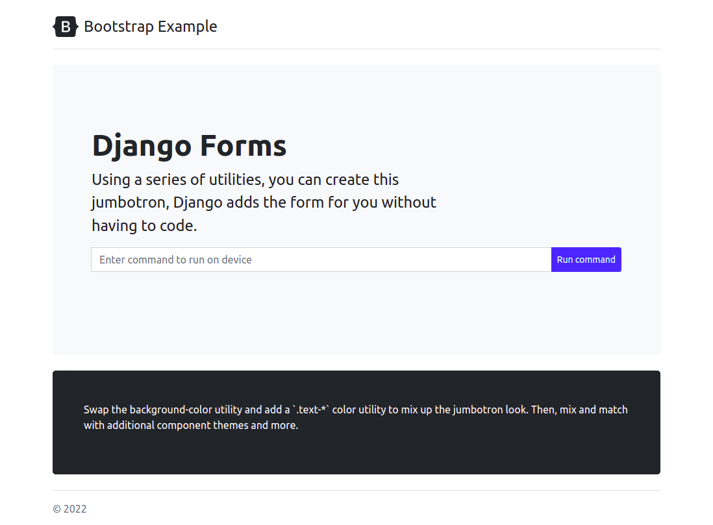

# Part 3 - Developing the application
In this section, we get our hands dirty and build the application. We learn how to connect to a router using Netmiko and create a web input form using Django templates.

- Connecting to a router
- Getting output from a router
- Creating a Django form
- Using Bootstrap5 templates
- Deploying the application
    * Configure firewall to allow ports
